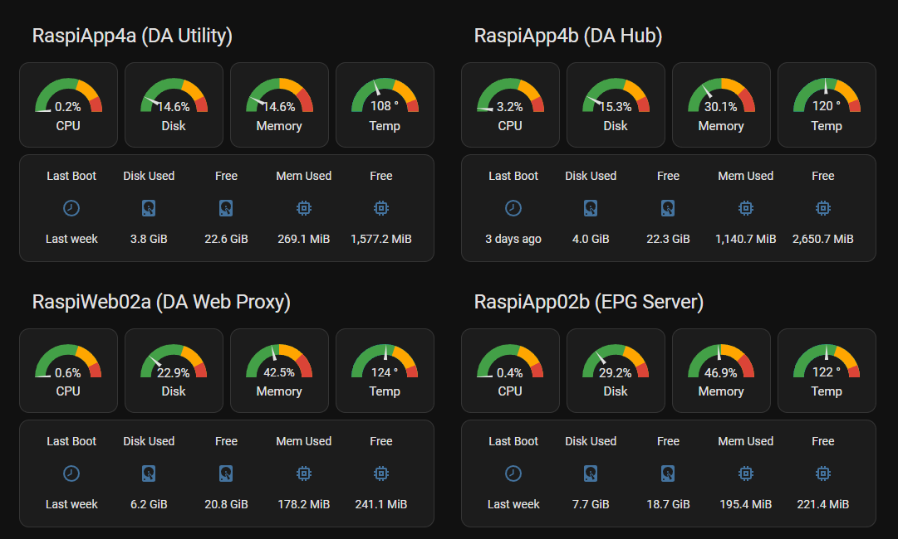
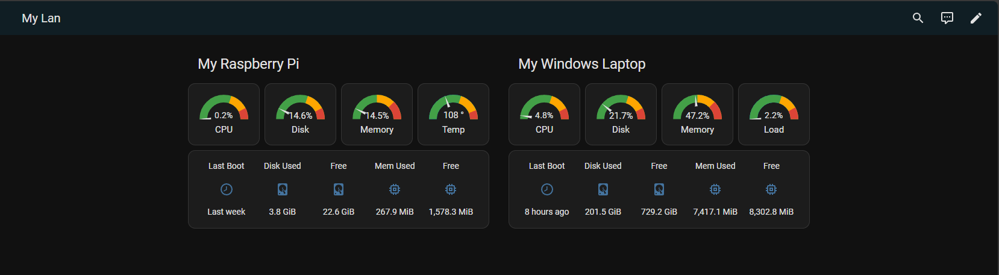

# ha-server-stat

### Home Assistant Server Stats Template (for use with Glances)



Home networks have expanded to include a wide variety of devices over the years.  In particular, windows desktops, laptops, Linux Boxes, NAS servers, Raspberry PI's, etc...

Keeping track of these cross-platform devices and their information has become a challenge.  Glances is an open-source cross platform monitoring tool that provides a htop (for you linux fans),
or task-monitory (for you windows users) interface to keep track of system cpu usages, disk/memory usage, tasks, etc...


# Requirements
This repository leverages 
- [Glances](https://github.com/nicolargo/glances) for system information 
- Home Assistant [decluttering-card](https://github.com/custom-cards/decluttering-card) Lovelace interface 

to provide a handy, easy-to-use template for displaying system information for windows, linux, raspberry pi systems.

# Pre-requisite Installs
## Glances

Glances is a python app that runs on target servers.  It gathers runtime information (cpu, disk, memory, processes, etc..) that is exposed via API to Home Assistant and is represented as
sensor data.

### Install
Refer to the [install directions](https://github.com/nicolargo/glances?tab=readme-ov-file#installation) for Glances.
- I use pipx for the installation, but pip/pip3 works also.
- At a minimum, the [web] feature needs to be installed (i.e. pipx install glances[web])
- I personally have tested it on Raspi OS, Ubuntu, Windows 10 and Windows 11.  
- The Windows web api seems to be a little intermittent responding, so sometims stats are not available.

### Configure

To configure targets:
- Go to the integration for Glances (Setting -> Devices and Services -> Glances)
- Click "Add Entry"
- Enter Host name
  - Note this was a bit tricky for me.  The short name didn't work, I had to fully qualify with a domain (in my case workgroup) name (i.e. MyLaptop.mylan)
- Click submit.  If it works, your device will be added, and entities will auto-populate with sensor data.
  
---

---

## decluttering-card

The decluttering-card provides the ability to build a re-usable template (card) to display information on your Home assistant dashboard, greatly reducing yaml bloat and making it easier
to provide consistent UI updates and features.

### Install

The [install instructions](https://github.com/custom-cards/decluttering-card#installation) show how to make the decluttring card available for your dashboards.

Installing the card by above instructions didn't work for me, so I installed/downloaded via HACS.
- Insure HACS is installed in HA.
- In HACS, search for declutting-card
- In the row displayed, click the three dots ... on right side.
- Click download to install the requisite .js file

It basically needs a javascript file (decluttering-card.js) to be installed in your Lovelace www directory (config/www/community/decluttering-card).

# Usage

## Validate Pre-requisites
- Install Glances on target machines (see above).  Be sure the service is started with the -w (web server) option.
  - Validate service is running by going to http://\<target machine\>:61208 and insure page is displayed.
- Configure Glances in your HA instance (see above).
  - Validate sensors are available (Setting -> Devices and Services -> Glances)
  - Insure devices are defined and entities are available.
  
- Install decluttering card in your Home Assistant instance (see above).

## Create a dashboard
- Settings -> Dashboards
- Click Add Daskboard (new daskboard from scratch)
  - Give it a meaningful title (i.e. LAN Hosts)
  - Click Create
- Open the dashboard
  - Click the pencil icon (top right) to edit the dashboard
  - Click the three dots (...) top right and select 'Raw configuration editor'
  You should see the below in the editor
  ```
  views:
  - title: LAN Hosts
  ```
- Copy the contents of the [decluttering_template.yaml](???) file to the top of the file (before the content above).  Beware of the indentation.

Your view should reflect below (... are collapsed sections)
```
decluttering_templates:
  glances_windows_device:
    ...
  glances_rpi_device:
    ...
  glances_linux_device: 
    ...
views:
  - title: LAN Hosts
```

You now have an empty dashboard with 3 available templates.  This represents a 'shell' dashboard.  You may now add content as desired.

## Create host cards for content

Each host is represented by a type block as follows:
```
    - type: grid
      cards:
        - type: custom:decluttering-card
          template: glances_XXX_device
          variables:
            - host: hostname
            - title: Friendly Name
```

- The **template** is glances_rpi_device OR glances_windows_device OR glances_linux_device depending on target.
- The **host** is the full host name as shown in the entity_id (Setting -> Devices and Services -> Glances).
- The **title** is the friendly name you want displayed in the UI.
 
# Example

Assume 

- Glances is setup and configured to monitor server1 (raspberry pi) and server2 (windows machine)

To create cards on this dashboard, use the Raw configuration editor add section below to the views:
```
    sections:
      - type: grid
        cards:
          - type: custom:decluttering-card
            template: glances_rpi_device
            variables:
              - host: server1_local
              - title: My Rasberry Pi
      - type: grid
        cards:
          - type: custom:decluttering-card
            template: glances_windows_device
            variables:
              - host: server2_local
              - title: My Windows Laptop
```

Full editor view with sections in decluttering_templates collapsed:

```
decluttering_templates:
  glances_windows_device:
    ...
  glances_rpi_device:
   ...
  glances_linux_device: 
    ...
views:
  - title: My Lan
    sections:
      - type: grid
        cards:
          - type: custom:decluttering-card
            template: glances_rpi_device
            variables:
              - host: raspiapp4a_damiconet
              - title: My Raspberry Pi
      - type: grid
        cards:
          - type: custom:decluttering-card
            template: glances_windows_device
            variables:
              - host: voyager_damiconet
              - title: My Windows Laptop
```

Save you changes and Click Done.  The dashboard should now look similar to:



To add additional hosts, simple continue to add the appropriate blocks for each host via the Raw configuration editor.

